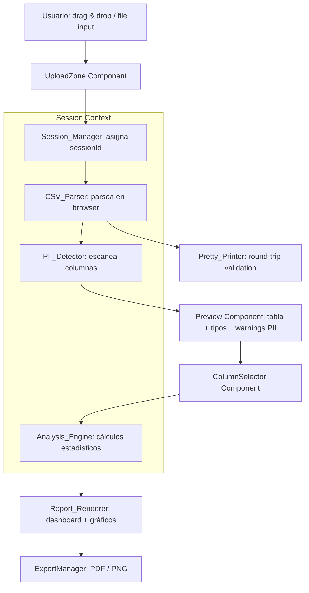

# Design Document — InsightBoard

## Overview

InsightBoard es una aplicación web 100% client-side construida en React que permite a usuarios cargar archivos CSV, explorar su estructura, ejecutar análisis estadísticos automáticos y visualizar los resultados en un dashboard interactivo. Todo el procesamiento ocurre en el navegador del usuario, sin ningún backend, garantizando privacidad absoluta y aislamiento de sesiones por pestaña.

### Objetivos de Diseño

- **Privacidad por diseño**: ningún dato sale del navegador en ningún momento.
- **Aislamiento de sesiones**: cada pestaña opera de forma completamente independiente.
- **Procesamiento en browser**: parseo CSV, cálculos estadísticos, generación de gráficos y exportación PDF/PNG son 100% client-side.
- **Experiencia fluida**: detección automática de tipos, alertas PII y estadísticas sin configuración manual.

### Stack Tecnológico

| Capa | Tecnología | Justificación |
|---|---|---|
| Framework UI | React 18 + TypeScript | Tipado estricto, ecosistema maduro |
| Parseo CSV | PapaParse | Librería battle-tested, streaming, sin backend |
| Gráficos | Recharts | Nativo React, composable, accesible |
| Heatmap | D3.js (solo heatmap) | Recharts no tiene heatmap nativo; D3 da control total |
| Estadísticas | simple-statistics | Librería pura JS, sin dependencias nativas |
| Exportación PDF | jsPDF + html2canvas | Generación de PDF client-side a partir de DOM |
| Exportación PNG | html2canvas | Captura de DOM a imagen |
| Estilos | Tailwind CSS | Utilidades atómicas, sin CSS en runtime |
| Tests unitarios | Vitest + React Testing Library | Rápido, compatible con Vite |
| Tests de propiedades | fast-check | PBT en TypeScript, activo y bien mantenido |

---

## Architecture

La aplicación sigue una arquitectura de **pipeline de datos unidireccional** donde cada fase transforma los datos y los pasa a la siguiente, sin estado compartido mutable entre componentes.



### Flujo de datos principal

1. El usuario carga un CSV → `UploadZone` valida tamaño y extensión.
2. `Session_Manager` inicializa un contexto de sesión con `sessionId` único (UUID v4).
3. `CSV_Parser` parsea el archivo y produce `DatasetMeta` + filas en memoria de sesión.
4. `PII_Detector` escanea las columnas y produce `Warning[]` de tipo `"pii"`.
5. `ColumnSelector` presenta el preview y permite al usuario elegir columnas.
6. `Analysis_Engine` ejecuta los cálculos sobre las columnas seleccionadas.
7. `Report_Renderer` construye el dashboard con los gráficos correspondientes.
8. `ExportManager` serializa el dashboard a PDF o PNG bajo demanda.

### Gestión de Estado

Se utiliza **React Context API + useReducer** para el estado de sesión. No se usa `localStorage` ni `sessionStorage` para datos del dataset (solo memoria de React), garantizando aislamiento entre pestañas.

```
SessionContext
  ├── sessionId: string (UUID v4, inmutable)
  ├── dataset: { meta: DatasetMeta, rows: Record<string, string>[] } | null
  ├── columnProfiles: ColumnProfile[]
  ├── selectedColumns: Set<string>
  ├── analysisResult: AnalysisResult | null
  └── warnings: Warning[]
```

---

## Components and Interfaces

### Session_Manager

Responsable de crear y mantener el contexto de sesión aislado por pestaña.

```typescript
interface SessionState {
  sessionId: string;
  dataset: { meta: DatasetMeta; rows: Record<string, string>[] } | null;
  columnProfiles: ColumnProfile[];
  selectedColumns: Set<string>;
  analysisResult: AnalysisResult | null;
  warnings: Warning[];
}

// Inicialización: sessionId = crypto.randomUUID() al montar el SessionProvider
// Almacenamiento: estado React en memoria (nunca localStorage/sessionStorage para datos)
// Limpieza: el estado se libera automáticamente al cerrar la pestaña (GC de JS)
```

### CSV_Parser

Wrapper sobre PapaParse que produce las estructuras internas del sistema.

```typescript
interface ParseResult {
  meta: DatasetMeta;
  rows: Record<string, string>[];
  warnings: Warning[];
}

function parseCSV(file: File, sessionId: string): Promise<ParseResult>
```

Manejo de headers duplicados: detectado en post-procesamiento de PapaParse. Si `headers[i] === headers[j]` para `i !== j`, se renombra `headers[j]` a `${headers[j]}_${count}` y se registra un `Warning` de tipo `"duplicate_header"`.

### Pretty_Printer

Convierte la estructura interna de vuelta a texto CSV válido (necesario para la propiedad de round-trip).

```typescript
function printCSV(
  rows: Record<string, string>[],
  headers: string[]
): string
```

Usa la misma lógica de escape que PapaParse (comillas dobles para campos con coma, salto de línea o comilla).

### Analysis_Engine

Ejecuta todos los cálculos estadísticos. Es una función pura que recibe datos y devuelve resultados, sin efectos secundarios.

```typescript
interface AnalysisInput {
  rows: Record<string, string>[];
  selectedColumns: string[];
  columnProfiles: ColumnProfile[];
  outlierMethod: 'iqr' | 'zscore';
  temporalColumn?: string;
}

function runAnalysis(input: AnalysisInput): AnalysisResult
```

Sub-funciones internas:

| Función | Descripción |
|---|---|
| `detectTypes(rows, headers)` | Inferencia de tipos por columna |
| `computeDescriptiveStats(values)` | Media, mediana, std, min, max, p25, p75 |
| `computeCorrelationMatrix(columns)` | Correlación de Pearson entre pares |
| `detectOutliersIQR(values)` | Outliers por IQR |
| `detectOutliersZScore(values)` | Outliers por Z-score |
| `computeDistributions(values)` | Frecuencias absolutas y relativas |
| `computeTrends(dateCol, numericCols)` | Regresión lineal simple para tendencia |

### PII_Detector

Inspección de columnas mediante expresiones regulares.

```typescript
interface PIIPattern {
  type: 'email' | 'phone' | 'id_document';
  regex: RegExp;
  label: string;
}

function detectPII(
  rows: Record<string, string>[],
  headers: string[]
): Warning[]
```

Patrones implementados:

| Tipo | Patrón (regex) |
|---|---|
| Email | `/^[^\s@]+@[^\s@]+\.[^\s@]+$/` |
| Teléfono | `/^\+?[\d\s\-().]{7,15}$/` |
| RUT chileno | `/^\d{1,2}\.\d{3}\.\d{3}-[\dkK]$/` |
| DNI español | `/^\d{8}[A-Z]$/` |

Una columna se marca como PII si **al menos un valor** coincide con algún patrón.

### Report_Renderer

Componente React que orquesta la generación del dashboard.

```typescript
interface ReportRendererProps {
  analysisResult: AnalysisResult;
  columnProfiles: ColumnProfile[];
  selectedColumns: string[];
  rows: Record<string, string>[];
}
```

Lógica de renderizado condicional de gráficos:

| Gráfico | Condición |
|---|---|
| Histograma | Por cada columna `numeric` seleccionada |
| Box Plot | Por cada columna `numeric` seleccionada |
| Heatmap | Solo si hay ≥ 2 columnas `numeric` seleccionadas |
| Barras de frecuencia | Por cada columna `text` o `boolean` seleccionada |
| Línea temporal | Por cada columna `numeric` si hay columna `date` seleccionada |

### ExportManager

```typescript
function exportToPDF(dashboardRef: React.RefObject<HTMLElement>): Promise<void>
function exportToPNG(dashboardRef: React.RefObject<HTMLElement>): Promise<void>
```

Usa `html2canvas` para capturar el DOM del dashboard y `jsPDF` para empaquetarlo en PDF. Todo client-side, sin upload a ningún servidor.

---

## Data Models

```typescript
interface DatasetMeta {
  filename: string;
  rowCount: number;
  columnCount: number;
  columns: string[];
  uploadedAt: string; // ISO 8601
  sessionId: string;
}

interface ColumnProfile {
  name: string;
  detectedType: 'numeric' | 'text' | 'date' | 'boolean';
  nullCount: number;
  nullPercent: number;    // 0–100
  uniqueCount: number;
  stats: DescriptiveStats | null; // null para columnas no numéricas
}

interface DescriptiveStats {
  mean: number;
  median: number;
  stdDev: number | null;  // null si < 2 valores no nulos
  min: number;
  max: number;
  p25: number;
  p75: number;
}

interface AnalysisResult {
  correlationMatrix: CorrelationMatrix | null;
  outliers: OutlierEntry[];
  distributions: Distribution[];
  trends: Trend[];
  warnings: Warning[];
}

interface CorrelationMatrix {
  columns: string[];
  values: number[][];  // values[i][j] = Pearson(col_i, col_j)
}

interface OutlierEntry {
  rowIndex: number;
  column: string;
  value: number;
  method: 'iqr' | 'zscore';
}

interface Distribution {
  column: string;
  frequencies: { value: string; count: number; percent: number }[];
}

interface Trend {
  column: string;
  temporalColumn: string;
  direction: 'ascending' | 'descending' | 'stable';
  slope: number;
  rSquared: number;
}

interface Warning {
  type: 'pii' | 'high_nulls' | 'duplicate_header' | 'insufficient_data';
  column: string;
  message: string;
}
```

### Reglas de Tipo Detectado

La detección de tipos en `Analysis_Engine.detectTypes()` sigue esta precedencia:

1. **boolean**: si todos los valores no nulos del campo (case-insensitive) pertenecen al conjunto `{true, false, yes, no, 1, 0, sí, si}`.
2. **date**: si ≥ 80% de los valores no nulos son parseables como fecha (usando `Date.parse()` + formato ISO o DD/MM/YYYY).
3. **numeric**: si ≥ 80% de los valores no nulos son parseables como número (`parseFloat`).
4. **text**: en cualquier otro caso.

---

## Correctness Properties

*A property is a characteristic or behavior that should hold true across all valid executions of a system — essentially, a formal statement about what the system should do. Properties serve as the bridge between human-readable specifications and machine-verifiable correctness guarantees.*

### Property 1: Validación de tamaño de archivo

*For any* archivo cuyo tamaño en bytes sea mayor a 52,428,800 (50 MB), el validador de carga SHALL retornar un resultado de rechazo, independientemente del contenido o nombre del archivo.

**Validates: Requirements 1.2**

---

### Property 2: Validación de extensión de archivo

*For any* nombre de archivo cuya extensión (en minúsculas) no sea `.csv`, el validador de carga SHALL retornar un resultado de rechazo.

**Validates: Requirements 1.3**

---

### Property 3: Round-trip CSV parse/print

*For any* estructura de dataset válida (filas + headers sin duplicados), serializar con `Pretty_Printer.printCSV()` y luego parsear de vuelta con `CSV_Parser.parseCSV()` SHALL producir un dataset con las mismas filas y los mismos headers que el original.

**Validates: Requirements 1.5**

---

### Property 4: Renombrado de headers duplicados

*For any* lista de headers que contenga al menos un duplicado, `CSV_Parser` SHALL producir una lista de headers donde todos los valores son únicos, y SHALL producir exactamente un `Warning` de tipo `"duplicate_header"` por cada header que fue renombrado.

**Validates: Requirements 1.6**

---

### Property 5: Detección de tipos es exhaustiva

*For any* columna con al menos un valor no nulo, `Analysis_Engine.detectTypes()` SHALL asignar exactamente uno de los tipos: `numeric`, `text`, `date`, o `boolean` — nunca null ni un valor fuera de ese conjunto.

**Validates: Requirements 2.2**

---

### Property 6: Invariantes de métricas nulas

*For any* columna con `N` filas totales y `K` celdas vacías o nulas, `Analysis_Engine` SHALL calcular `nullCount = K`, `nullPercent = (K / N) * 100`, y `uniqueCount ≤ N - K`. Además, `nullCount + (N - nullCount) = N`.

**Validates: Requirements 2.3**

---

### Property 7: Warning de high_nulls

*For any* columna cuyo `nullPercent` sea estrictamente mayor a 80, la lista de warnings SHALL contener al menos un `Warning` con `type = "high_nulls"` para esa columna.

**Validates: Requirements 2.4**

---

### Property 8: Renderizado completo de ColumnProfile

*For any* objeto `ColumnProfile`, la función de renderizado del componente de vista previa SHALL producir una salida que contenga el nombre de la columna, el tipo detectado, el `nullPercent` y el `uniqueCount`.

**Validates: Requirements 2.5**

---

### Property 9: El análisis solo incluye columnas seleccionadas

*For any* llamada a `runAnalysis()` con un conjunto `selectedColumns` de tamaño ≥ 1, el `AnalysisResult` resultante SHALL referenciar únicamente columnas que pertenezcan a `selectedColumns` — ningún resultado (stats, outliers, distributions, trends, correlationMatrix) SHALL referenciar columnas no seleccionadas.

**Validates: Requirements 3.3**

---

### Property 10: Invariantes de estadísticas descriptivas

*For any* lista de valores numéricos no nulos con al menos 2 elementos, `computeDescriptiveStats()` SHALL producir estadísticas que satisfagan: `min ≤ p25 ≤ median ≤ p75 ≤ max`, y `min ≤ mean ≤ max`.

**Validates: Requirements 4.1**

---

### Property 11: Invariantes estructurales de la matriz de correlación de Pearson

*For any* conjunto de 2 o más columnas numéricas con al menos 30 filas válidas en común, la `correlationMatrix` SHALL satisfacer: (a) la diagonal es 1.0, (b) la matriz es simétrica (`values[i][j] = values[j][i]`), y (c) todos los valores están en el rango `[-1, 1]`.

**Validates: Requirements 5.1**

---

### Property 12: Validez de outliers detectados

*For any* columna numérica y cualquier método de detección (IQR o Z-score), cada `OutlierEntry` en `outliers[]` SHALL satisfacer el criterio del método seleccionado:
- IQR: el valor está fuera del rango `[Q1 - 1.5×IQR, Q3 + 1.5×IQR]`
- Z-score: `|z| > 3` donde `z = (valor - media) / stdDev`

**Validates: Requirements 6.1, 6.2**

---

### Property 13: Invariante de suma de distribuciones

*For any* columna categórica o booleana con `N` filas no nulas, la suma de `frequencies[i].count` en su `Distribution` SHALL ser igual a `N`, y la suma de `frequencies[i].percent` SHALL ser igual a 100 (con tolerancia de ±0.01 por redondeo flotante).

**Validates: Requirements 7.1**

---

### Property 14: Consistencia de dirección de tendencia con pendiente

*For any* par (columna numérica, columna temporal) con suficientes datos para regresión, el campo `direction` en `Trend` SHALL ser consistente con el signo de `slope`: `slope > 0.001 → "ascending"`, `slope < -0.001 → "descending"`, `-0.001 ≤ slope ≤ 0.001 → "stable"`.

**Validates: Requirements 8.1**

---

### Property 15: Correctitud de detección PII

*For any* columna donde al menos un valor coincida con alguno de los patrones PII definidos (email, teléfono, RUT, DNI), `PII_Detector.detectPII()` SHALL retornar al menos un `Warning` de tipo `"pii"` para esa columna. *For any* columna donde ningún valor coincida con ningún patrón PII, no SHALL retornar `Warning` de tipo `"pii"` para esa columna.

**Validates: Requirements 9.1, 9.2**

---

### Property 16: Completitud del dashboard generado

*For any* `AnalysisResult` con `W` warnings y `F` hallazgos (correlaciones fuertes, outliers detectados), la salida del `Report_Renderer` SHALL contener exactamente `W` elementos de warning visibles y SHALL incluir referencias a todos los hallazgos presentes en el resultado.

**Validates: Requirements 10.2, 10.3**

---

### Property 17: Unicidad de sessionIds

*For any* conjunto de `N` sesiones inicializadas por `Session_Manager` (donde `N ≥ 2`), todos los `sessionId` asignados SHALL ser distintos entre sí.

**Validates: Requirements 12.1**

---

## Error Handling

### Errores de carga de archivo

| Condición | Comportamiento |
|---|---|
| Archivo > 50 MB | Rechazar con mensaje: "El archivo supera el límite de 50 MB." |
| Extensión no CSV | Rechazar con mensaje: "Solo se aceptan archivos con extensión .csv." |
| CSV malformado (error de parseo) | Mostrar error de PapaParse con número de línea si disponible |
| Archivo vacío (0 filas de datos) | Mostrar error: "El archivo CSV no contiene datos." |

### Errores del Analysis_Engine

Todas las funciones del `Analysis_Engine` son funciones puras que retornan `Result<T, AnalysisError>` (patrón Either). Nunca lanzan excepciones — en su lugar retornan un error tipado con descripción.

```typescript
type AnalysisError =
  | { kind: 'insufficient_data'; column: string; minRequired: number; actual: number }
  | { kind: 'invalid_type'; column: string; expectedType: string }
  | { kind: 'empty_column'; column: string }
```

### Errores de exportación

Si `html2canvas` o `jsPDF` fallan (ej. por restricciones de memoria), el `ExportManager` captura la excepción y muestra un toast de error no bloqueante al usuario. El dashboard permanece visible e intacto.

### Degradación graceful

Si un gráfico individual falla al renderizarse (ej. datos insuficientes para heatmap), el `Report_Renderer` muestra un placeholder con el mensaje de error en lugar del gráfico, sin afectar el resto del dashboard.

---

## Testing Strategy

### Enfoque dual: Unit Tests + Property-Based Tests

Los tests de unidad y los tests de propiedades son complementarios y ambos son necesarios:

- **Tests unitarios**: verifican ejemplos específicos, casos borde y condiciones de error.
- **Tests de propiedades**: verifican propiedades universales a través de miles de inputs generados aleatoriamente.

### Tests Unitarios

Se usan para:
- Ejemplos concretos de parseo de CSV (1 fila, headers específicos)
- Casos borde documentados: archivo vacío, columna con todos nulls, CSV con 1 sola columna
- Integración entre componentes: flujo completo upload → analysis → render
- Comportamiento de `ExportManager` ante fallos de librería

Framework: **Vitest + React Testing Library**

```bash
vitest --run
```

### Tests de Propiedades (PBT)

Framework: **fast-check** (TypeScript, activo, well-maintained)

Configuración mínima: **100 iteraciones por propiedad** (configurable vía `fc.configureGlobal({ numRuns: 100 })`).

Cada test de propiedad incluye un comentario de trazabilidad al formato:
```
// Feature: insightboard, Property N: <texto de la propiedad>
```

Cada propiedad del diseño DEBE ser implementada por exactamente UN test de propiedad con fast-check.

#### Generadores clave

```typescript
// Generador de filas de CSV
const csvRowArb = fc.dictionary(fc.string(), fc.string())

// Generador de valores numéricos con nulls
const numericColumnArb = fc.array(fc.oneof(fc.double(), fc.constant(null)))

// Generador de columna categórica
const categoricalColumnArb = fc.array(fc.oneof(fc.string(), fc.constant(null)))

// Generador de nombres de archivo con extensión aleatoria
const filenameArb = fc.string().map(s => s + fc.oneof(
  fc.constant('.csv'), fc.constant('.xlsx'), fc.constant('.json')
))

// Generador de sessionIds: N UUIDs únicos
const sessionBatchArb = (n: number) => 
  fc.uniqueArray(fc.uuid(), { minLength: n, maxLength: n })
```

#### Mapeo Propiedad → Test PBT

| Propiedad | Test fast-check | Patrón |
|---|---|---|
| P1: Validación tamaño | `fc.integer({ min: 52428801 })` → validator rechaza | Error condition |
| P2: Validación extensión | `fc.string()` no terminado en `.csv` → validator rechaza | Error condition |
| P3: Round-trip CSV | `fc.array(fc.dictionary(...))` → parse(print(x)) ≅ x | Round-trip |
| P4: Headers duplicados | `fc.array` con duplicados forzados → headers únicos + warnings | Invariant |
| P5: Tipos exhaustivos | `fc.array(fc.oneof(...))` → tipo ∈ {numeric, text, date, boolean} | Invariant |
| P6: Métricas nulas | array con nulls → nullCount + nonNull = N | Invariant |
| P7: Warning high_nulls | columna con >80% nulls → warning existe | Invariant |
| P8: Rendering ColumnProfile | `fc.record(ColumnProfile)` → output contiene campos | Invariant |
| P9: Solo columnas seleccionadas | `fc.subarray(columns)` → resultado no menciona otras | Invariant |
| P10: Stats ordering | `fc.array(fc.double(), {minLength: 2})` → min≤p25≤median≤p75≤max | Invariant |
| P11: Correlación Pearson | 2+ columnas ≥30 filas → diagonal=1, simétrica, ∈[-1,1] | Invariant |
| P12: Outlier validity | `fc.array(fc.double())` → cada outlier cumple criterio | Invariant |
| P13: Suma distribuciones | `fc.array(fc.string())` → sum(count)=N, sum(%)=100 | Invariant |
| P14: Dirección vs pendiente | parejas (date[], number[]) → direction consistente con slope | Metamorphic |
| P15: PII detection | valores con/sin patrón PII → warnings presentes/ausentes | Round-trip |
| P16: Dashboard completitud | `fc.record(AnalysisResult)` → W warnings, F hallazgos | Invariant |
| P17: Unicidad sessionIds | `N` inicializaciones → N IDs distintos | Invariant |

### Cobertura objetivo

| Capa | Objetivo |
|---|---|
| `CSV_Parser` + `Pretty_Printer` | 95% (incluye round-trip PBT) |
| `Analysis_Engine` | 90% (todos los paths estadísticos) |
| `PII_Detector` | 95% (todos los patrones regex) |
| `Session_Manager` | 85% |
| `Report_Renderer` (lógica condicional) | 80% |
| Componentes UI (React) | 70% (React Testing Library) |
